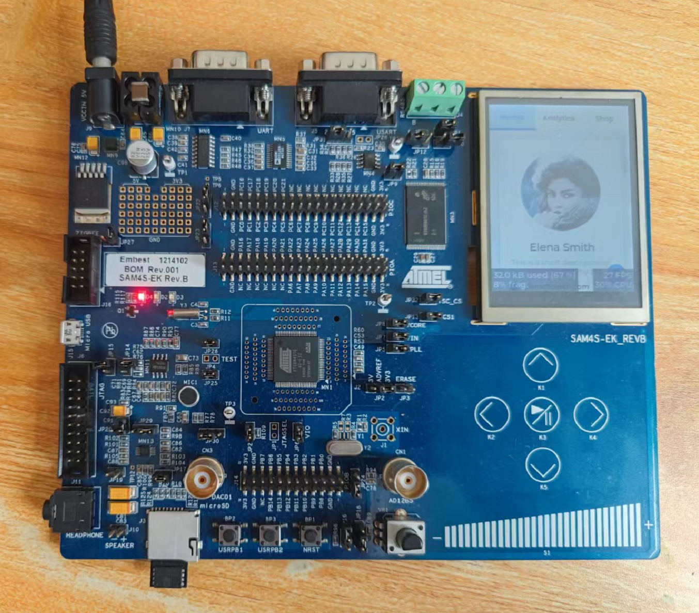

# SAM4S-EK 垃圾佬计划

------

50元就能从咸鱼买到的SAM4S-EK,虽然是老古董了,但是也不是完全没研究价值,主要是其实从来没用过Atmel ARM单片机(现在应该叫Microchip),只用过他们的AVR,很是怀念.但是收到发现是完全点亮的,也就慢慢研究了,就当娱乐.



## 0. 写在最前

这里贴的例子都是非常有限的,所有外设代码都不会在这里写,不过都验证过了才整合成这个工程,大家其他代码要参考asf,里面仍有大量资料可参考,以及对应的芯片手册等等.但是我不建议直接用asf开始,主要难于解耦合,而且工程牵连很多文件,比如ASF driver selector tool这玩意就只能用于Atmel Studio,比如我这里用IAR就白扯了.大家可以下载本Repo,然后删除不需要的,剩下便是干净工程.

## 1. 本源目录结构

 1. applications - 主程序代码
 2. EWARM - 工程文件
 3. thirdparty - 三方库
 4. xdk-asf - 针对本平台的ASF库
 5. misc - 其他内容
    1. docs - 官方文档
    2. xdk-asf-3.52.0 - 官方ASF
    3. img - 工作图片
    4. bin - 预编译二进制

## 2. 主要参数

 1. Cortex-M4 内核 (没错,没有FPU!)
 2. 主频:120MHz 储存:2*512 KBytes 内存:128 KBytes 缓存:2KB
 3. PIO:79 EBI:4 ADC:16 DAC:2 Timer:6 PDC:22 UART:2 USART:2 HSMCI:1
 4. 各种基础功能该有都有

## 3. 片上外设计划

- [X] Analog Comparator Controller (ACC) - 模拟比较器(8路输入,4个内部参考,输出至PWM事件,可中断.)
- [X] Analog-to-Digital Converter (ADC/ADC12B) - ADC(1Msps,12位,温度传感器,可编程增益,16个输入,定时器/PWM/PWM Fault/外部引脚/软件触发,PDC传输,单端/差分输入)
- [X] Chip Identifier (CHIPID) - 芯片ID(读取芯片基础信息)
- [X] Cyclic Redundancy Check Calculation Unit (CRCCU) - CRC计算器(内置DMA,支持CCITT16/CASTAGNOLI/CCITT8023标准)
- [X] Digital-to-Analog Converter Controller (DACC) -  DAC(2个独立输出,12位,GPIO触发,PDC传输)
- [X] Static Memory Controller (SMC) - 静态连接控制器(4CS,16MBytes/CS,8bit,字节/双字节/四字节传输)
- [x] Enhanced Embedded Flash Controller (EEFC) - Flash 控制器(程序中改写Flash,唯一ID)
- [x] General Purpose Backup Registers (GPBR) - 备份域储存器(存量:256Bit)
- [x] High Speed MultiMedia Card Interface (HSMCI) - HSMCI(SDIO 2.0/MMC 4.3/SDIO 2.0/CE-ATA 1.1)
- [x] Bus Matrix (MATRIX) - 可配置总线矩阵(可以让特定外设优先)
- [x] SAM Peripheral DMA Controller (PDC) - DMA(APB外设专用)
- [x] Parallel Input/Output (PIO) - 并行输入/输出模块(把一堆GPIO当并行口用)
- [x] Power Management Controller (PMC) - 电源/时钟管理
- [x] Pulse Width Modulation (PWM) - PWM(4通道,16位主计数器,12位死区计数器,双缓冲,边缘对齐,故障输入,比较单元,内部同步)
- [x] Reset Controller (RSTC) - 复位控制器(复位原因读取,用户复位处理.)
- [x] Real-time Timer (RTT) - 实时定时器(32位计数器,16位分频器,可中断,低频时钟/RTC 1Hz)
- [X] Serial Peripheral Interface (SPI) - SPI(PDC传输,8~16位,4片选)
- [X] Synchronous Serial Controller (SSC) - I2S(正常的I2S外设,TK/TF/TD为发送组,RD/RF/RK为接收组,K为时钟,F为WS,D为数据.)
- [X] Supply Controller (SUPC) - 电源控制(类似BOR,备份域,时钟切换都在这里,管理层面比PMC低)
- [X] Timer Counter (TC) - 定时器(与PWM功能类似,类似弱化版的PWM外设)
- [X] Two-Wire Interface (TWI) - TWI(比I2C功能少,基本功能都实现了,Atmel躲避专利的产品)
- [X] Universal Synchronous Asynchronous Receiver Transmitter (USART) - USART(即UART附带SPI模式支持)
- [x] USB Device Port (UDP) - USB (仅设备模式,FS,8 EP)

## 4. 板上外设计划

- [x] 12 MHz crystal - 主晶体
- [x] 32.768 KHz crystal - RTC晶体
- [x] NAND Flash - 256MB 板载储存
- [x] 2.8 inch TFT color LCD display with touch panel and backlight - 可调亮度,24位显示器.
- [x] UART port with level shifter circuit - RS232
- [x] USART port with level shifter circuit multiplexed with RS485 port with level shifter circuit - RS485
- [X] Microphone input and mono/stereo headphone jack output - 纯ADC/DAC接口测试罢了,实在是想不明白,好好放着I2S外设不用.
- [x] SD/MMC interface - TF卡槽
- [x] Reset button: NRST - 复位按钮
- [x] User buttons: Left and Right - 两个按键,可中断.
- [x] QTouch® buttons: Up, Down, Left, Right, Valid and Slider - 滑条和触摸按键.
- [X] Full Speed USB device port
- [x] JTAG/ICE port - 调试接口(无板载调试器)
- [x] On-board power regulation - 板载5V -> 3V3降压电路.
- [x] Two user LEDs - 蓝色和绿色,GPIO控制.
- [x] Power LED - 红色,GPIO控制.
- [X] BNC connector for ADC input
- [X] BNC connector for DAC output
- [X] User potentiometer connected to the ADC input
- [x] ZigBEE connector - 排针引出,无模块.
- [x] 2x32 bit PIO connection interfaces (PIOA, PIOC) and 1x16 bit PIO connection interface (PIOB) - 排针引出.

## 5. 三方软件
- [x] LVGL
- [x] FreeRTOS
- [x] Fatfs

## 6. ASF 使用笔记

### 6.1 查找一个例子

 1. 外设类驱动例子: xdk-asf-X.YY.Z/[common,sam]/drivers/[外设名]/[功能]_example/[板卡名]/[IDE]
 2. 外设类测试单元: xdk-asf-X.YY.Z/[common,sam]/drivers/[外设名]/unit_tests_example/[板卡名]/[IDE]
 3. USB类:xdk-asf-X.YY.Z/common/usb/class/[hid,cdc...]/[device,host,dual]/[功能]/example/[板卡名]/[IDE]
 4. 三方类:xdk-asf-X.YY.Z/thirdparty/[库名]/[...]]/[功能]_example/[板卡名]/[IDE]
 5. 例子中可能没覆盖自己的板卡,可以根据其他同类板卡修改,比如USB多点触摸例子等.

### 6.2 关于开源/闭源

 1. ASF 中存在不少闭源的内容,因此本工程也只能引用其库,比如FTL.
 2. 本工程代码随便用,你乐意的话给我留个记号也行.
 3. 这是一个玩具,应该也没人拿来干什么吧,毕竟这么老了,还没FPU.
 4. LVGL移植例子中使用了外置储存器,因此请插入TF卡,或注释掉相关代码.

## 7. 测试代码

### LVGL 图片显示

```c
UNUSED(pvParameters);

lv_obj_t *img = lv_img_create(lv_scr_act());
lv_img_set_src(img, "0:240x320.bin");
lv_obj_align(img, LV_ALIGN_RIGHT_MID, 0, 0);

for (;;)
{
    vTaskDelay(1000);
}
```

### FatFS 读写

```c
uint32_t i;
FATFS fs;
FRESULT res;
DIR dirs;
FIL file_object;

UINT byte_read;
UINT byte_written;

uint8_t data_buffer[2048];

const char *file_name = "0:Basic.bin";

/* Mount disk*/
printf("-I- Mount disk\n\r");
res = f_mount(&fs, "0:", 0);
if (res != FR_OK)
{
    printf("-E- f_mount pb: 0x%X\n\r", res);
    return;
}
printf("-I- Mount ok\n\r");

/* Test if the disk is formatted */
res = f_opendir(&dirs, "/");
if (res == FR_OK)
{
    /* Erase sd card to reformat it ? */
    puts("-I- The disk is already formatted.\r");
}

if (res == FR_NO_FILESYSTEM)
{
    /* Format disk */
    printf("-I- Format disk ... \n\r");
    puts("-I- Please wait a moment during formatting...\r");
    res = f_mkfs("0:", /* Drv */
                    0, data_buffer, 2048);
    puts("-I- Disk format finished !\r");
    if (res != FR_OK)
    {
        printf("-E- f_mkfs pb: 0x%X\n\r", res);
        return;
    }
}
else if (FR_OK != res)
{
    printf("-E- f_opendir pb: 0x%X\n\r", res);
    return;
}

/* Create a new file */
printf("-I- Create a file : \"%s\"\n\r", file_name);
res = f_open(&file_object, (char const *)file_name,
                FA_CREATE_ALWAYS | FA_WRITE);
if (res != FR_OK)
{
    printf("-E- f_open create pb: 0x%X\n\r", res);
    return;
}

/* Write a checkerboard pattern in the buffer */
for (i = 0; i < 2048; i++)
{
    if ((i & 1) == 0)
    {
        data_buffer[i] = (i & 0x55);
    }
    else
    {
        data_buffer[i] = (i & 0xAA);
    }
}

puts("-I- Write file\r");
for (i = 0; i < (4 * 1024); i += 2048)
{
    res = f_write(&file_object, data_buffer, 2048,
                    &byte_written);

    if (res != FR_OK)
    {
        printf("-E- f_write pb: 0x%X\n\r", res);
        return;
    }
}

/* Close the file */
puts("-I- Close file\r");
res = f_close(&file_object);
if (res != FR_OK)
{
    printf("-E- f_close pb: 0x%X\n\r", res);
    return;
}

/* Open the file */
printf("-I- Open the same file : \"%s\"\n\r", file_name);
res = f_open(&file_object, (char const *)file_name,
                FA_OPEN_EXISTING | FA_READ);
if (res != FR_OK)
{
    printf("-E- f_open read pb: 0x%X\n\r", res);
    return;
}

/* Read file */
puts("-I- Read file\r");
memset(data_buffer, 0, 2048);

res = f_read(&file_object, data_buffer, 2048, &byte_read);
if (res != FR_OK)
{
    printf("-E- f_read pb: 0x%X\n\r", res);
    return;
}
/* Close the file*/
puts("-I- Close file\r");
res = f_close(&file_object);
if (res != FR_OK)
{
    printf("-E- f_close pb: 0x%X\n\r", res);
    return;
}

/* Compare the read data with the expected data */
for (i = 0; i < 2048; i++)
{
    if (!((((i & 1) == 0) && (data_buffer[i] == (i & 0x55))) ||
            (data_buffer[i] == (i & 0xAA))))
    {
        printf(
            "Invalid data at data[%u] (expected 0x%02X, read 0x%02X)\n\r",
            (unsigned int)i,
            (unsigned int)(((i & 1) == 0) ? (i & 0x55) : (i & 0xAA)),
            (unsigned int)data_buffer[i]);
    }
}
puts("-I- File data Ok !\r");
return;
```

### QTouch

```c
UNUSED(pvParameters);

lv_obj_t *arc = lv_arc_create(lv_scr_act());

/*Status flags to indicate the re-burst for library */
uint16_t status_flag = 0u;
uint16_t burst_flag = 0u;

uint8_t vld_pressed = 0;
uint8_t up_pressed = 0;
uint8_t dwn_pressed = 0;
uint8_t lft_pressed = 0;
uint8_t rgt_pressed = 0;

static uint8_t old_position = 0;

/* Current time */
volatile uint16_t current_time_ms_touch = 0u;

lv_obj_set_size(arc, 150, 150);
lv_arc_set_rotation(arc, 135);
lv_arc_set_bg_angles(arc, 0, 270);
lv_arc_set_range(arc, 0, 255);
lv_arc_set_value(arc, 10);
lv_obj_align(arc, LV_ALIGN_CENTER, 0, 0);

/* Reset touch sensing */
qt_reset_sensing();

/* Configure the Sensors as keys or Keys With Rotor/Sliders in this function */
qt_enable_key(BOARD_VALID_KEY_CHANNEL, AKS_GROUP_1, 18u, HYST_6_25);
qt_enable_key(BOARD_UP_KEY_CHANNEL, AKS_GROUP_1, 18u, HYST_6_25);
qt_enable_key(BOARD_DOWN_KEY_CHANNEL, AKS_GROUP_1, 18u, HYST_6_25);
qt_enable_key(BOARD_LEFT_KEY_CHANNEL, AKS_GROUP_1, 18u, HYST_6_25);
qt_enable_key(BOARD_RIGHT_KEY_CHANNEL, AKS_GROUP_1, 18u, HYST_6_25);

qt_enable_slider(BOARD_SLIDER_START_CHANNEL, BOARD_SLIDER_END_CHANNEL,
                    AKS_GROUP_1, 16u, HYST_6_25, RES_8_BIT, 0u);

/* Initialise touch sensing */
qt_init_sensing();

/* Set the parameters like recalibration threshold, Max_On_Duration etc in this function by the user */
qt_config_data.qt_di = DEF_QT_DI;
qt_config_data.qt_neg_drift_rate = DEF_QT_NEG_DRIFT_RATE;
qt_config_data.qt_pos_drift_rate = DEF_QT_POS_DRIFT_RATE;
qt_config_data.qt_max_on_duration = DEF_QT_MAX_ON_DURATION;
qt_config_data.qt_drift_hold_time = DEF_QT_DRIFT_HOLD_TIME;
qt_config_data.qt_recal_threshold = DEF_QT_RECAL_THRESHOLD;
qt_config_data.qt_pos_recal_delay = DEF_QT_POS_RECAL_DELAY;

/* Loop forever */
for (;;)
{
    vTaskDelay(25);
    current_time_ms_touch += 25;
    do
    {
        /*  One time measure touch sensors    */
        status_flag = qt_measure_sensors(current_time_ms_touch);

        burst_flag = status_flag & QTLIB_BURST_AGAIN;

        /*Time critical host application code goes here */
    } while (burst_flag);

    /*  Time Non-critical host application code goes here */
    if ((GET_SENSOR_STATE(BOARD_VALID_KEY_ID) != 0) && (vld_pressed == 0))
    {
        vld_pressed = 1;
        lv_obj_align(arc, LV_ALIGN_CENTER, 0, 0);
    }
    else
    {
        if ((GET_SENSOR_STATE(BOARD_VALID_KEY_ID) == 0) && (vld_pressed == 1))
        {
            vld_pressed = 0;
        }
    }
    if ((GET_SENSOR_STATE(BOARD_UP_KEY_ID) != 0) && (up_pressed == 0))
    {
        up_pressed = 1;
        lv_obj_align(arc, LV_ALIGN_TOP_MID, 0, 10);
    }
    else
    {
        if ((GET_SENSOR_STATE(BOARD_UP_KEY_ID) == 0) && (up_pressed == 1))
        {
            up_pressed = 0;
        }
    }
    if ((GET_SENSOR_STATE(BOARD_DOWN_KEY_ID) != 0) && (dwn_pressed == 0))
    {
        dwn_pressed = 1;
        lv_obj_align(arc, LV_ALIGN_BOTTOM_MID, 0, 0);
    }
    else
    {
        if ((GET_SENSOR_STATE(BOARD_DOWN_KEY_ID) == 0) && (dwn_pressed == 1))
        {
            dwn_pressed = 0;
        }
    }
    if ((GET_SENSOR_STATE(BOARD_LEFT_KEY_ID) != 0) && (lft_pressed == 0))
    {
        lft_pressed = 1;
        lv_obj_align(arc, LV_ALIGN_LEFT_MID, 10, 0);
    }
    else
    {
        if ((GET_SENSOR_STATE(BOARD_LEFT_KEY_ID) == 0) && (lft_pressed == 1))
        {
            lft_pressed = 0;
        }
    }
    if ((GET_SENSOR_STATE(BOARD_RIGHT_KEY_ID) != 0) && (rgt_pressed == 0))
    {
        rgt_pressed = 1;
        lv_obj_align(arc, LV_ALIGN_RIGHT_MID, -10, 0);
    }
    else
    {
        if ((GET_SENSOR_STATE(BOARD_RIGHT_KEY_ID) == 0) && (rgt_pressed == 1))
        {
            rgt_pressed = 0;
        }
    }

    if (GET_ROTOR_SLIDER_POSITION(0) != old_position)
    {
        old_position = GET_ROTOR_SLIDER_POSITION(0);
        lv_arc_set_value(arc, (255 - old_position));
    }
}
```

### 普通按键(中断)

```c
QueueHandle_t xButtonQueue;

static void Button1_Handler(uint32_t id, uint32_t mask)
{
	uint8_t i;
	BaseType_t xHigherPriorityTaskWoken;

	xHigherPriorityTaskWoken = pdFALSE;

	if (ID_PIOB == id && PIO_PB3 == mask)
	{
		i = 0;
		xQueueSendFromISR(xButtonQueue, &i, &xHigherPriorityTaskWoken);
	}

	/* Now the buffer is empty we can switch context if necessary. */
	if (xHigherPriorityTaskWoken)
	{
		/* Actual macro used here is port specific. */
		portYIELD_FROM_ISR(xHigherPriorityTaskWoken);
	}
}

static void Button2_Handler(uint32_t id, uint32_t mask)
{
	uint8_t i;
	BaseType_t xHigherPriorityTaskWoken;

	xHigherPriorityTaskWoken = pdFALSE;

	if (ID_PIOC == id && PIO_PC12 == mask)
	{
		i = 1;
		xQueueSendFromISR(xButtonQueue, &i, &xHigherPriorityTaskWoken);
	}

	/* Now the buffer is empty we can switch context if necessary. */
	if (xHigherPriorityTaskWoken)
	{
		/* Actual macro used here is port specific. */
		portYIELD_FROM_ISR(xHigherPriorityTaskWoken);
	}
}

static void led_set(lv_event_t *e)
{
	lv_event_code_t code = lv_event_get_code(e);
	lv_obj_t *obj = lv_event_get_target(e);
	if (code == LV_EVENT_VALUE_CHANGED)
	{
		const char *txt = lv_checkbox_get_text(obj);
		if (lv_obj_get_state(obj) & LV_STATE_CHECKED)
		{
			if (!strcmp(txt, "LED Red"))
			{
				ioport_set_pin_level(PIO_PC20_IDX, 1);
			}
			else if (!strcmp(txt, "LED Blue"))
			{
				ioport_set_pin_level(PIO_PA19_IDX, 0);
			}
			else if (!strcmp(txt, "LED Green"))
			{
				ioport_set_pin_level(PIO_PA20_IDX, 0);
			}
		}
		else
		{
			if (!strcmp(txt, "LED Red"))
			{
				ioport_set_pin_level(PIO_PC20_IDX, 0);
			}
			else if (!strcmp(txt, "LED Blue"))
			{
				ioport_set_pin_level(PIO_PA19_IDX, 1);
			}
			else if (!strcmp(txt, "LED Green"))
			{
				ioport_set_pin_level(PIO_PA20_IDX, 1);
			}
		}
	}
}

static void application(void *pvParameters)
{
	UNUSED(pvParameters);

	uint8_t btn;
	lv_obj_t *cb;
	lv_obj_t *label = lv_label_create(lv_scr_act());

	lv_obj_set_width(label, 150);

	lv_obj_align(label, LV_ALIGN_BOTTOM_MID, 0, 10);
	lv_label_set_text(label, "NOBTN");

	lv_obj_set_flex_flow(lv_scr_act(), LV_FLEX_FLOW_COLUMN);
	lv_obj_set_flex_align(lv_scr_act(), LV_FLEX_ALIGN_CENTER, LV_FLEX_ALIGN_START, LV_FLEX_ALIGN_CENTER);

	cb = lv_checkbox_create(lv_scr_act());
	lv_checkbox_set_text(cb, "LED Red");
	lv_obj_add_state(cb, LV_STATE_CHECKED);
	lv_obj_add_event_cb(cb, led_set, LV_EVENT_ALL, NULL);

	cb = lv_checkbox_create(lv_scr_act());
	lv_checkbox_set_text(cb, "LED Blue");
	lv_obj_add_state(cb, LV_STATE_DEFAULT);
	lv_obj_add_event_cb(cb, led_set, LV_EVENT_ALL, NULL);

	cb = lv_checkbox_create(lv_scr_act());
	lv_checkbox_set_text(cb, "LED Green");
	lv_obj_add_state(cb, LV_STATE_DEFAULT);
	lv_obj_add_event_cb(cb, led_set, LV_EVENT_ALL, NULL);

	xButtonQueue = xQueueCreate(1, sizeof(unsigned long));

	/* Configure Pushbutton 1 */
	pmc_enable_periph_clk(ID_PIOB);
	pio_set_debounce_filter(PIOB, PIO_PB3, 10);
	/* Interrupt on rising edge  */
	pio_handler_set(PIOB, ID_PIOB,
					PIO_PB3, PIO_PULLUP | PIO_DEBOUNCE | PIO_IT_RISE_EDGE, Button1_Handler);
	NVIC_EnableIRQ((IRQn_Type)ID_PIOB);
	pio_handler_set_priority(PIOB,(IRQn_Type)ID_PIOB, 0);
	pio_enable_interrupt(PIOB, PIO_PB3);

	/* Configure Pushbutton 2 */
	pmc_enable_periph_clk(ID_PIOB);
	pio_set_debounce_filter(PIOC, PIO_PC12, 10);
	/* Interrupt on falling edge */
	pio_handler_set(PIOC, ID_PIOC,
					PIO_PC12, PIO_PULLUP | PIO_DEBOUNCE | PIO_IT_FALL_EDGE, Button2_Handler);
	NVIC_EnableIRQ((IRQn_Type)ID_PIOC);
	pio_handler_set_priority(PIOC,(IRQn_Type)ID_PIOC, 0);
	pio_enable_interrupt(PIOC, PIO_PC12);

	lv_obj_update_layout(cb);

	/* Loop forever */
	for (;;)
	{
		if (xButtonQueue != NULL)
		{
			if (xQueueReceive(xButtonQueue,&(btn),(TickType_t)portMAX_DELAY) == pdPASS)
			{
				if (btn == 0)
				{
					lv_label_set_text(label, "USRPB1");
				}
				else if (btn == 1)
				{
					lv_label_set_text(label, "USRPB2");
				}
			}
		}
	}
}
```